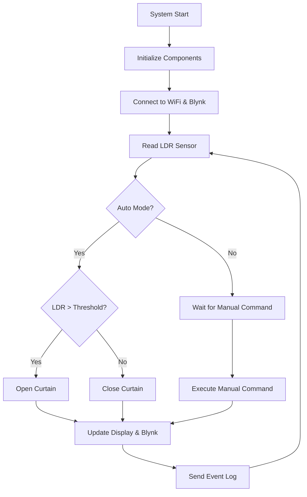

 # 🏠 Sistem Kontrol Tirai Otomatis Berbasis LDR

<div align="center">

**Smart Curtain Control System with Light Sensor & IoT Integration**

[🎥 Demo Video](https://youtube.com/watch?v=your-video-id) • [🔗 Live Simulation](https://wokwi.com/projects/435815194823336961) 

</div>

## 📖 Deskripsi

Sistem kontrol tirai otomatis yang menggunakan sensor LDR (Light Dependent Resistor) untuk mendeteksi intensitas cahaya dan secara otomatis mengatur posisi tirai. Dilengkapi dengan fitur IoT menggunakan platform Blynk untuk monitoring dan kontrol jarak jauh melalui smartphone.

### ✨ Fitur Utama

- 🔆 **Auto Light Detection** - Otomatis buka/tutup berdasarkan intensitas cahaya
- 📱 **Remote Control** - Kontrol via smartphone dengan Blynk app
- 🖥️ **Real-time Display** - LCD menampilkan status sistem
- 🔄 **Dual Mode** - Mode otomatis dan manual
- ⚙️ **Adjustable Threshold** - Threshold cahaya dapat disesuaikan
- 🔔 **Event Logging** - Notifikasi real-time ke smartphone
- 💡 **Visual Indicator** - LED status tirai

## 🛠️ Komponen Hardware

| Komponen | Spesifikasi | Fungsi |
|----------|-------------|---------|
| **Mikrokontroler** | ESP32 DevKit V1 | Unit pemroses utama dengan WiFi |
| **Sensor Cahaya** | LDR + Resistor 10kΩ | Mendeteksi intensitas cahaya |
| **Aktuator** | Servo Motor | Menggerakkan mekanisme tirai |
| **Display** | LCD 16x2 I2C (0x27) | Menampilkan status sistem |
| **Indikator** | LED + Resistor 220Ω | Indikator visual status tirai |
| **Power Supply** | 5V DC | Catu daya sistem |

## 🔌 Wiring Diagram

```
ESP32 DevKit V1 Connections:
├── A0  ── LDR Sensor (with 10kΩ pulldown)
├── D4  ── Servo PWM
├── D2  ── LED Indicator (with 220Ω resistor)
├── D21 ── LCD SDA
├── D22 ── LCD SCL
├── 5V  ── VCC (Servo, LCD)
├── 3V3 ── LDR VCC
└── GND ── Common Ground
```

## 🚀 Quick Start

### 1. Prerequisites

- Arduino IDE atau PlatformIO
- ESP32 Board Package
- Libraries yang diperlukan (lihat [Libraries](#-libraries))
- Akun Blynk IoT

### 2. Installation

```bash
# Clone repository
git clone https://github.com/username/tirai-otomatis-ldr-esp32.git
cd tirai-otomatis-ldr-esp32

# Buka file .ino di Arduino IDE
# Install libraries yang diperlukan
# Upload ke ESP32
```

### 3. Configuration

1. **Setup Blynk:**
   ```cpp
   #define BLYNK_TEMPLATE_ID "YOUR_TEMPLATE_ID"
   #define BLYNK_TEMPLATE_NAME "YOUR_TEMPLATE_NAME"
   #define BLYNK_AUTH_TOKEN "YOUR_AUTH_TOKEN"
   ```

2. **WiFi Configuration:**
   ```cpp
   char ssid[] = "YOUR_WIFI_SSID";
   char pass[] = "YOUR_WIFI_PASSWORD";
   ```

3. **Hardware Pins (jika berbeda):**
   ```cpp
   const int ldrPin = A0;      // LDR sensor pin
   const int servoPin = 4;     // Servo control pin  
   const int ledPin = 2;       // LED indicator pin
   ```

## 📚 Libraries

Install libraries berikut melalui Arduino IDE Library Manager:

```cpp
#include <WiFi.h>              // ESP32 WiFi - Built-in
#include <BlynkSimpleEsp32.h>  // Blynk for ESP32
#include <ESP32Servo.h>        // Servo control for ESP32
#include <LiquidCrystal_I2C.h> // I2C LCD display
```

### Library Installation Commands:
```bash
# Via Arduino IDE Library Manager, search and install:
- Blynk by Volodymyr Shymanskyy
- ESP32Servo by Kevin Harrington  
- LiquidCrystal I2C by Frank de Brabander
```

## 📱 Blynk Setup

### Virtual Pins Configuration:

| Virtual Pin | Type | Function | Description |
|-------------|------|----------|-------------|
| V0 | Display | LDR Value | Monitoring nilai sensor cahaya |
| V1 | Display | Curtain Status | Status tirai (0=Tutup, 1=Buka) |
| V2 | Display | Mode Status | Mode operasi (0=Manual, 1=Auto) |
| V3 | Display | Threshold | Nilai threshold cahaya |
| V4 | Button | Manual Toggle | Tombol buka/tutup manual |
| V5 | Switch | Auto/Manual Mode | Toggle mode otomatis/manual |
| V6 | Slider | Threshold Adjust | Pengaturan threshold (0-1023) |

### Blynk Dashboard Setup:

1. **Monitoring Widgets:**
   - Gauge untuk LDR Value (V0)
   - LED untuk Curtain Status (V1) 
   - LED untuk Mode Status (V2)
   - Value Display untuk Threshold (V3)

2. **Control Widgets:**
   - Button untuk Manual Toggle (V4)
   - Switch untuk Mode Toggle (V5)
   - Slider untuk Threshold (V6, range: 0-1023)

## 🎮 Cara Penggunaan

### Mode Otomatis
1. Pastikan switch Mode di Blynk dalam posisi "AUTO"
2. Sistem akan otomatis:
   - **Membuka tirai** ketika cahaya terang (LDR > threshold)
   - **Menutup tirai** ketika cahaya redup (LDR ≤ threshold)
3. Threshold dapat disesuaikan via slider di Blynk app

### Mode Manual
1. Switch Mode ke posisi "MANUAL" di Blynk app
2. Gunakan tombol "Manual Toggle" untuk buka/tutup tirai
3. LED indikator akan menyala ketika tirai terbuka

### Monitoring
- **LCD Display:** Menampilkan nilai LDR, threshold, status tirai, dan mode
- **Blynk App:** Real-time monitoring semua parameter
- **Serial Monitor:** Debug information (115200 baud)

## 📊 System Workflow



## 🔧 Customization

### Mengubah Timing:
```cpp
timer.setInterval(1000L, readSensors);    // Sensor reading interval
timer.setInterval(1000L, updateDisplay);  // Display update interval  
timer.setInterval(5000L, sendToBlynk);    // Blynk update interval
```

### Mengubah Servo Positions:
```cpp
curtainServo.write(0);   // Closed position (0°)
curtainServo.write(90);  // Open position (90°)
```

### Default Threshold:
```cpp
int lightThreshold = 500;  // Adjust based on your lighting condition
```

## 🐛 Troubleshooting

### Masalah Umum:

1. **Tidak terhubung ke WiFi**
   ```
   - Periksa SSID dan password WiFi
   - Pastikan ESP32 dalam jangkauan WiFi
   - Restart ESP32 dan router
   ```

2. **Blynk tidak terhubung**
   ```
   - Verifikasi Template ID dan Auth Token
   - Periksa koneksi internet
   - Cek status Blynk server
   ```

3. **Servo tidak bergerak**
   ```
   - Periksa koneksi pin D4
   - Pastikan power supply 5V cukup
   - Test servo dengan kode sederhana
   ```

4. **LCD tidak menampilkan**
   ```
   - Periksa koneksi I2C (SDA=D21, SCL=D22)
   - Scan alamat I2C (biasanya 0x27 atau 0x3F)
   - Periksa power supply LCD
   ```

5. **LDR tidak sensitif**
   ```
   - Periksa koneksi LDR dan resistor pulldown
   - Kalibrasi ulang threshold
   - Pastikan LDR tidak tertutup/terhalang
   ```

## 📈 Performance Tips

1. **Optimasi Power:**
   - Gunakan deep sleep jika battery powered
   - Kurangi interval update untuk hemat bandwidth

2. **Stabilitas Sensor:**
   - Tambahkan filter averaging untuk nilai LDR
   - Implementasi hysteresis untuk mencegah chattering

3. **Network Reliability:**
   - Tambahkan reconnection logic
   - Implement local fallback control

## 🔮 Future Enhancements

- [ ] **Voice Control** - Integrasi dengan Google Assistant/Alexa
- [ ] **Scheduling** - Timer-based curtain control
- [ ] **Weather Integration** - API cuaca untuk smart control
- [ ] **Multiple Curtains** - Support untuk beberapa tirai
- [ ] **Machine Learning** - Adaptive threshold learning
- [ ] **OTA Updates** - Wireless firmware updates
- [ ] **Local Web Server** - Backup control interface
- [ ] **Data Analytics** - Usage statistics dan patterns

## 🤝 Contributing

Kontribusi sangat diterima! Silakan:

1. Fork repository ini
2. Buat feature branch (`git checkout -b feature/AmazingFeature`)
3. Commit perubahan (`git commit -m 'Add some AmazingFeature'`)
4. Push ke branch (`git push origin feature/AmazingFeature`)
5. Buat Pull Request

## 👥 Contributors

- **[Adzi Bilal]** - *Initial work* - [@adzibilal](https://github.com/adzibilal)

## 🙏 Acknowledgments

- [Blynk IoT Platform](https://blynk.io/) untuk cloud service
- [Wokwi Simulator](https://wokwi.com/) untuk prototyping
- [ESP32 Community](https://github.com/espressif/arduino-esp32) untuk library support
- Arduino Community untuk ecosystem yang luar biasa

---

<div align="center">

**⭐ Jika project ini membantu, jangan lupa berikan star! ⭐**

Made with ❤️ by Adzi Bilal

</div>
